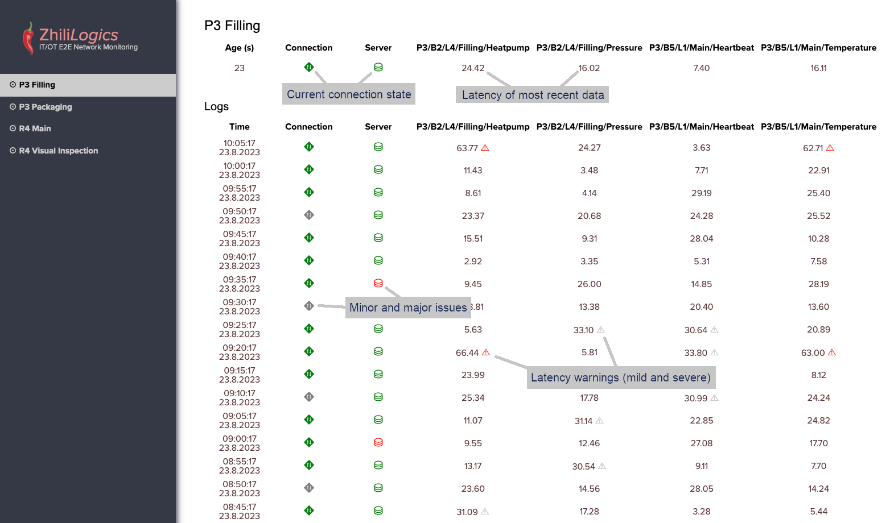

# IT/OT E2E Network Monitoring

State-of-the-art manufacturing process monitoring tools gather data from multi-site and even global environments.
In complex networks comprising firewalls and servers, unavoidable factors and events can lead to unreliable data flow.
Common issues include network connection overloads, changes in firewall configurations, or server restarts.
Often, comprehensive monitoring of all network components cannot be guaranteed, resulting in delayed problem detection.
Ensuring data reliability in manufacturing process monitoring is crucial for maintaining the trust of users and regulatory authorities in IT the systems.

Our end-to-end network monitoring tool for **OPC UA systems** is designed to detect any disruptions in data flow between production areas and cloud-based applications at an early stage.
This proactive approach allows for troubleshooting to begin before users become aware of any issues.

The monitoring tool comprises two components: the monitoring core and an intuitive web interface.
It is compatible with current Linux and Windows servers and can also be deployed in container-based environments.
The tool is highly flexible, allowing for control via configuration files and plugins.

In addition to OPC UA nodes, IT/OT E2E Network Monitoring supports the following endpoints:
- Generic web interfaces
- Log files
- PI server tags (currently in development)
- SQL database queries (in a future version)

**Please note**: The IT/OT E2E Network Monitoring tool is currently available in an early developer version below v1.0.
This version can be used free of charge until the first stable release (v1.0) is available.

